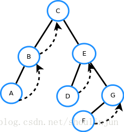

#### 二叉树的中序遍历
+ 递归方法
+ 迭代方法(标记数组法)
+ Morris中序遍历方法（空间复杂度为O(1)的中序遍历方法）

##### 递归方法
按照访问左子树——根节点——右子树的方式遍历这棵树，而在访问左子树或者右子树的时候我们按照同样的方式遍历，直到遍历完整棵树。
因此整个遍历过程天然具有递归的性质，我们可以直接用递归函数来模拟这一过程。

```
Time: O(n)  Space: O(n) -- 递归栈所占用的存储空间, n为二叉树中节点的个数，当二叉树为链表时，空间复杂度O(n)

class Solution:
    def __init__(self):
        self.ans = []

    def inorderTraversal(self, root: TreeNode) -> List[int]:
        # 深度优先遍历
        self.dfs(root)
        return self.ans
    
    def dfs(self, node: TreeNode) -> List[int]:
        if not node:
            return None
        self.dfs(node.left)
        self.ans.append(node.val)
        self.dfs(node.right)
```

##### 迭代方法
迭代方法则是将递归的过程具体化，采用一个 栈 来存储节点，其中由于需要将节点按照 “右--》根--》左” 的顺序压入栈中（这是
由于栈后进先出的性质决定的）， 因此需要采用一个 visited 数组来标记当前节点是否访问过。 这种思想对于二叉树的前序、中序
和后序遍历、层序遍历均通用。

```
Time: O(N)  Space: O(N) -- N为二叉树结点的个数

class Solution:
    def inorderTraversal(self, root: TreeNode) -> List[int]:
        # 迭代 -- 用栈来存储待访问的节点，用visited数组来存储已经访问过的节点
        ans = []
        visited = []
        # 根节点入栈
        stack = [root]
        while stack:
            node = stack.pop()  # pop() 方法默认从最后一个节点开始弹出
            if not node:
                continue
            if node not in visited:
                # 由于栈为先进后出，因此插入顺序需要逆序
                stack.extend([node.right, node, node.left])
                # 将node节点标识为已访问其左右节点
                visited.append(node)
            else:
                ans.append(node.val)
        return ans
```

##### Morris 中序遍历
思路与算法:
**Morris 遍历算法是另一种遍历二叉树的方法，它能将非递归的中序遍历空间复杂度降为 O(1)。**

Morris 遍历的实质就是避免用栈结构，而是让下层到上层有指针，具体是通过让底层节点指向 null 的空闲指针指回上层的
某个节点，从而完成下层到上层的移动。

Morris 遍历算法整体步骤如下（假设当前遍历到的节点为 x）：

[^-^]:
    列表嵌套只需在子列表中的选项前面添加四个空格即可：
    
1. 如果 x 无左孩子，先将 x 的值加入答案数组，再访问 x 的右孩子，即 `x=x.right`。
2. 如果 x 有左孩子，则找到 x 左子树上最右的节点（即左子树中序遍历的最后一个节点，x 在中序遍历中的前驱节点），我们
记为 `predecessor`。根据 `predecessor` 的右孩子是否为空，进行如下操作。
    + 如果 `predecessor` 的右孩子为空，则将其右孩子指向 x，然后访问 x 的左孩子，即 `x=x.left`。
    + 如果 `predecessor` 的右孩子不为空，则此时其右孩子指向 x，说明我们已经遍历完 x 的左子树，我们将 `predecessor` 的
右孩子置空，将 x 的值加入答案数组，然后访问 x 的右孩子，即 `x=x.right`。
重复上述操作，直至访问完整棵树。

  

```
class Solution:
    def inorderTraversal(self, root: TreeNode) -> List[int]:
        ret = []
        while root:
            if root.left:
                # 找到左子树的最右节点
                predecessor = root.left
                while predecessor.right:
                    predecessor = predecessor.right
                # 将右节点的右指针指向root
                predecessor.right = root
                # 左子树的叶子节点指向父节点
                temp = root
                root = root.left
                temp.left = None
            else:
                ret.append(root.val)
                root = root.right

        return ret
```